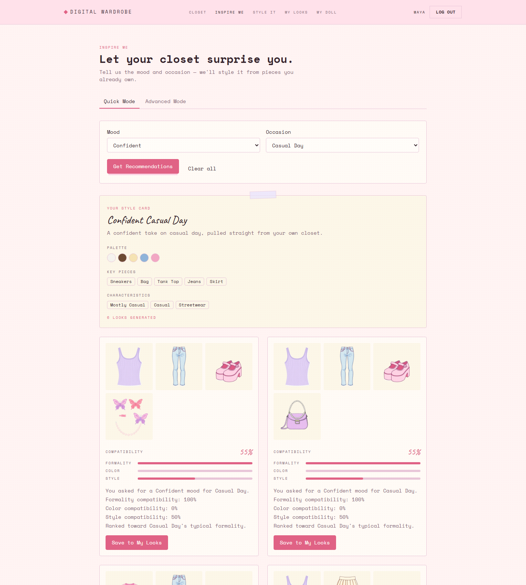
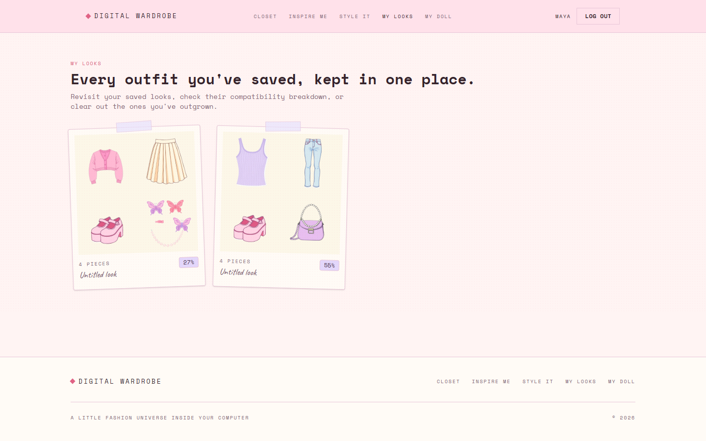
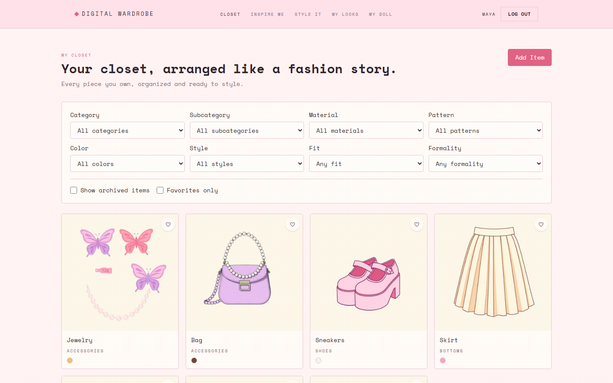
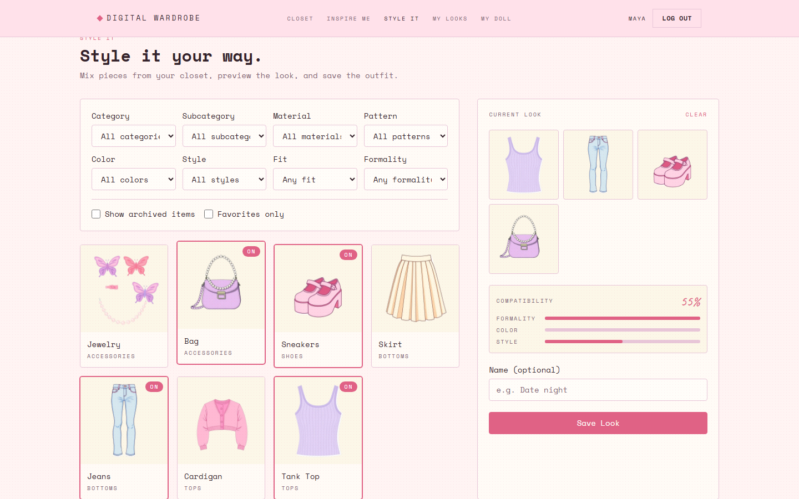
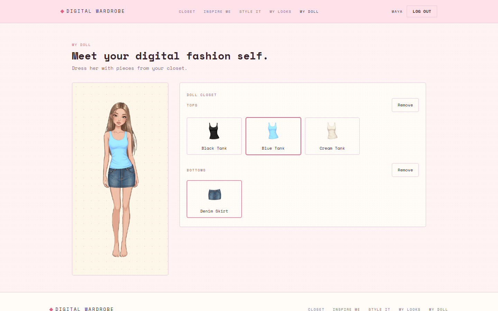

# Digital Wardrobe

A digital wardrobe and personal styling assistant built around clothes you actually own. Upload your real closet, get deterministic outfit recommendations with explainable scoring, build looks by hand, save your favorites, and dress a customizable 2D avatar with your own garments.

Full-stack TypeScript: a layered Express REST API on top of Supabase (PostgreSQL + Storage), and a feature-based React SPA.

---

## Application Preview

|                                                          Inspire Me                                                          |                                                        My Looks                                                        |
| :----------------------------------------------------------------------------------------------------------------------------: | :------------------------------------------------------------------------------------------------------------------------: |
| Algorithmic outfit recommendations, generated from the user's own closet with an explainable compatibility score. | Every saved outfit, with its compatibility breakdown, kept in one place. |
|  |  |

|                                                            Closet                                                            |                                                          Style It                                                          |
| :------------------------------------------------------------------------------------------------------------------------------: | :----------------------------------------------------------------------------------------------------------------------: |
| The user's real wardrobe — uploaded, classified, filterable, favoritable, archivable. | The manual outfit builder: freely combine real closet pieces and preview the look before saving. |
|  |  |

|                                                            My Doll                                                            |
| :--------------------------------------------------------------------------------------------------------------------------------: |
| A customizable 2D fashion avatar, dressed with layered, illustrated garment assets. |
|  |

---

## Table of Contents

- [Overview](#overview)
- [Core Features](#core-features)
- [How Recommendations Work](#how-recommendations-work)
- [Tech Stack](#tech-stack)
- [Architecture](#architecture)
- [Project Structure](#project-structure)
- [Getting Started](#getting-started)
- [Environment Variables](#environment-variables)
- [Available Scripts](#available-scripts)
- [Testing](#testing)
- [Documentation](#documentation)

---

## Overview

Digital Wardrobe helps users rediscover and creatively reuse the clothing they already own, instead of managing an inventory or shopping for more. The product loop is:

```
Closet  →  Inspire Me / Style It  →  Outfit  →  My Looks
```

with a separate, complementary creative loop for the avatar experience:

```
My Doll  →  Customize  →  Dress
```

The recommendation engine is **deterministic and rule-based by design** — no external AI service, no black-box scoring. Every recommendation ships with an evidence-based explanation of exactly why it was suggested, built from the same factors that produced its score.

## Core Features

### 👗 Closet
Upload photos of real clothing and classify each piece by category, subcategory, material, pattern, color(s), style(s), fit, and formality. Items can be favorited, archived, restored, edited, and permanently deleted (deletion is blocked if the piece is still used in a saved Look, to avoid silently corrupting it). The Closet is the single source of truth for every other feature.

### ✨ Inspire Me
The algorithmic styling experience. Pick a **Mood** and **Occasion** (Quick Mode) — or add **Formality preference**, a **required item**, **items to avoid**, and favorite-piece prioritization (Advanced Mode) — and get ranked, complete outfits (top + bottom *or* dress, always with shoes and accessories, optionally outerwear) generated from the closet alone. Each result includes:
- a **compatibility score** (0–100%), broken down into Formality / Color / Style;
- a plain-language **explanation** of the factors that drove that score;
- a generated **Style Card** — a vibe name, description, color palette, key pieces, and characteristics for the whole recommendation session.

Outfits scoring 20% or below are never shown — an empty result is more honest than a low-quality suggestion.

### 🎨 Style It
The manual outfit builder. Freely combine any pieces from the closet, see a live compatibility preview as you build, name the look, and save it — user-driven, as opposed to Inspire Me's algorithm-driven flow.

### 💾 My Looks
Every outfit saved from either Inspire Me or Style It, in one gallery, each with its compatibility breakdown. Deleting a saved Look never deletes the underlying closet items.

### 🪆 My Doll
A customizable 2D fashion avatar dressed with layered, pre-illustrated garment assets — no drawing required. Equip or remove tops, bottoms, shoes, and accessories per category and watch the doll update live.

### 🔐 Admin
A protected area for platform administrators to view and manage users (activate/deactivate) and manage global catalogs and doll items.

## How Recommendations Work

The Inspire Me pipeline is fully deterministic:

1. Read the user's active closet items and the selected Mood / Occasion / Advanced-Mode filters.
2. Generate every structurally valid outfit combination (Top + Bottom, or Dress; always Shoes + Accessories; optional Outerwear), honoring any required item / excluded items.
3. Score each combination: **Formality alignment to the requested context (40%)** + **Color overlap (30%)** + **Style overlap (30%)**.
4. Rank by score (with a small, non-exclusionary bonus for favorited pieces, when requested), drop anything at or below the 20% floor, and return the top results.
5. Generate a Style Card and a factual, score-derived explanation for each result.

Mood is used descriptively (it shapes the Style Card's tone and copy) but never algorithmically — by explicit product decision, so that recommendation quality stays anchored to formality/color/style compatibility rather than an unvalidated mood heuristic.

## Tech Stack

**Frontend** — `frontend/`
- React 19 + TypeScript, built with Vite
- React Router for client-side routing
- TanStack Query for server state (caching, invalidation, mutations)
- Tailwind CSS v4 for styling, `clsx` + `tailwind-merge` for conditional class composition
- Vitest + React Testing Library for tests

**Backend** — `backend/`
- Node.js + Express 5 + TypeScript, layered architecture (Routes → Middlewares → Controllers → Services → Repositories)
- Zod for request validation
- JWT (`jsonwebtoken`) + `bcrypt` for authentication
- Multer (in-memory) for image upload handling
- Jest + Supertest for unit and integration tests

**Persistence** — Supabase
- PostgreSQL for all relational data
- Supabase Storage for clothing-item images (uploaded server-side, never written to local disk)

## Architecture

The backend follows a strict layered architecture with one-way dependencies:

```
Routes → Middlewares → Controllers → Services → Repositories → Supabase
                                          ↓
                                     Validators
```

- **Routes** wire URLs to controllers and attach middleware (auth, validation).
- **Controllers** are thin — they extract the request and delegate.
- **Services** hold all business logic and orchestration; they're the only layer allowed to combine multiple repositories.
- **Repositories** are the only layer that talks to Supabase.
- **Validators** (Zod schemas) guard every request body/query before it reaches a controller.

The frontend is organized by feature, not by technical layer — each feature under `src/features/` owns its components, hooks, services, and types, with a small set of shared primitives in `src/components/`.

Full technical detail lives in [ARCHITECTURE.md](./ARCHITECTURE.md).

## Project Structure

```
digital-wardrobe/
├── backend/                 Express + TypeScript API
│   ├── src/
│   │   ├── routes/          URL → controller wiring
│   │   ├── middlewares/     auth, validation, upload, error handling
│   │   ├── controllers/     thin request/response glue
│   │   ├── services/        business logic (incl. the recommendation engine)
│   │   ├── repositories/    the only layer that talks to Supabase
│   │   ├── validators/      Zod request schemas
│   │   ├── types/           shared TypeScript types
│   │   └── utils/           JWT, password hashing, image storage, errors
│   ├── database/migrations/ versioned, forward-only SQL migrations
│   └── tests/                unit/ and integration/ (Jest + Supertest)
│
├── frontend/                 React + Vite + TypeScript client
│   └── src/
│       ├── features/         one folder per feature (closet, inspireMe, styleIt, myLooks, doll, auth, admin, ...)
│       ├── components/       shared UI primitives (Button, Modal, Select, Toast, ...)
│       ├── pages/             route-level components
│       ├── routes/            router config + protected-route guard
│       └── services/api/      the shared Axios client
│
├── docs/screenshots/         README preview images
├── PROJECT_SPECIFICATION.md  product requirements, domain model, business rules (source of truth)
├── ARCHITECTURE.md           technical architecture and conventions
└── DEVELOPMENT_PLAN.md       phased implementation workflow
```

## Getting Started

### Prerequisites

- Node.js 20+
- A [Supabase](https://supabase.com) project (PostgreSQL + Storage), with the migrations in `backend/database/migrations/` applied via the Supabase SQL Editor, in order

### Backend

```bash
cd backend
npm install
cp .env.example .env   # fill in SUPABASE_URL, SUPABASE_KEY, JWT_SECRET
npm run dev             # http://localhost:4000
```

### Frontend

```bash
cd frontend
npm install
cp .env.example .env   # set VITE_API_URL if the backend isn't on the default port
npm run dev             # http://localhost:5173
```

With both running, register an account at `http://localhost:5173/register` to get started.

## Environment Variables

**`backend/.env`**

| Variable | Required | Default | Description |
| --- | --- | --- | --- |
| `SUPABASE_URL` | Yes | — | Your Supabase project URL |
| `SUPABASE_KEY` | Yes | — | Supabase **service role** key (server-side only — never expose this) |
| `JWT_SECRET` | Yes | — | Secret used to sign access tokens |
| `PORT` | No | `4000` | Port the API listens on |
| `NODE_ENV` | No | `development` | `production` hides internal error messages from API responses |
| `CORS_ORIGIN` | No | `http://localhost:5173` | The single origin allowed to call the API |
| `JWT_EXPIRES_IN` | No | `1d` | Access token lifetime |

**`frontend/.env`**

| Variable | Required | Default | Description |
| --- | --- | --- | --- |
| `VITE_API_URL` | No | `http://localhost:4000/api/v1` | Base URL the client sends API requests to (baked in at build time) |

## Available Scripts

**Backend** (`backend/`)

| Script | Purpose |
| --- | --- |
| `npm run dev` | Start the API in watch mode |
| `npm run build` | Type-check and compile to `dist/` |
| `npm start` | Run the compiled build |
| `npm test` | Run the Jest test suite |
| `npm run lint` | ESLint over `src`, `tests`, `scripts` |

**Frontend** (`frontend/`)

| Script | Purpose |
| --- | --- |
| `npm run dev` | Start the Vite dev server |
| `npm run build` | Type-check and build for production |
| `npm run preview` | Preview the production build locally |
| `npm test` | Run the Vitest suite |
| `npm run lint` | ESLint over `src` |

## Testing

- **Backend**: Jest + Supertest, split into `backend/tests/unit` (services, the recommendation engine, utilities) and `backend/tests/integration` (full route → controller → service → repository request cycles against a mocked Supabase client).
- **Frontend**: Vitest + React Testing Library, colocated with each component/hook.

Both suites are run against every feature change; the recommendation engine in particular is covered by dedicated tests for candidate generation, compatibility scoring, and ranking.

## Documentation

- [`PROJECT_SPECIFICATION.md`](./PROJECT_SPECIFICATION.md) — product requirements, domain model, business rules, functional/non-functional requirements, and MVP scope. The primary product-level source of truth.
- [`ARCHITECTURE.md`](./ARCHITECTURE.md) — technical architecture, layer responsibilities, dependency rules, and conventions.
- [`DEVELOPMENT_PLAN.md`](./DEVELOPMENT_PLAN.md) — phased implementation workflow.

---

Built by [Milagros Cerutti](https://github.com/MilagrosCerutti).
